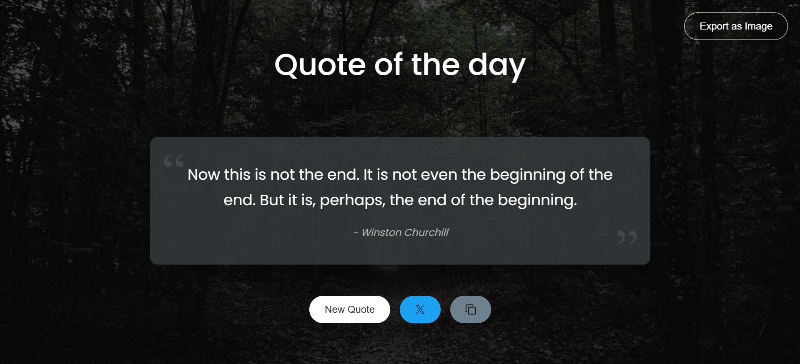

# Quote of the Day App

Hi there! 👋 This is the assignment for the cohort JS Assignment 3.

## Features

- Get random quote with just a click and on reload.
- Tweet your favorite quotes directly.
- Copy quotes to clipboard.
- Export quotes as images to save on your computer.
- Background changes with each new quote.

## Screenshots

_Main app interface showing a random quote_

_Exporting a quote as an image_

## Deployment Link

You can try the app yourself here: [Quote of the Day App](https://codermodersd.github.io/cohort-assignment-1/)
